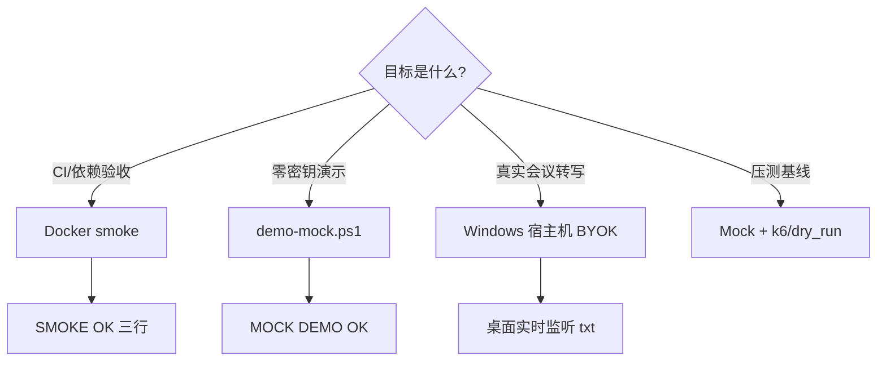

# meeting-ai-copilot 部署与运维指南

本文档面向**最终用户部署**与**维护者运维**。本工具是 Windows 桌面端实时转写助手，不是多租户 Web 服务；生产使用即在用户 PC 上长期运行。

## 1. 部署形态

| 形态 | 用途 | 说明 |
| --- | --- | --- |
| **Windows 宿主机（推荐）** | 真实会议转写 | 双击 `启动云端实时转写和AI答案.bat`，采集 WASAPI Loopback |
| **Docker smoke** | CI / 依赖自检 | 仅验证配置加载与问题识别逻辑，**不能**采集 Windows 系统声音 |

## 2. 前置条件

- Windows 10/11，Python 3.10+（启动脚本会自动创建 `.venv`）
- 火山引擎账号：实时 ASR Key + Coding Plan AI Key
- 会议软件（如腾讯会议）声音从电脑扬声器/耳机播放

## 3. 首次部署（Windows）

```powershell
git clone https://github.com/Hou-mingyuan/meeting-ai-copilot.git
cd meeting-ai-copilot
copy config.example.json config.json
# 编辑 config.json 填入 cloud_asr_api_key 与 ai_api_key
启动云端实时转写和AI答案.bat
```

或使用环境变量（适合不想在磁盘留 Key 的场景）：

```powershell
$env:VOLC_ASR_API_KEY = "your-asr-key"
$env:VOLCENGINE_CODING_PLAN_API_KEY = "your-ai-key"
.venv\Scripts\python.exe src\cloud_asr_volcengine.py --config config.json
```

详细配置项见 [USAGE.md](USAGE.md)。

## 4. 输出与日志

默认输出目录：`桌面\实时监听\`

| 文件 | 说明 |
| --- | --- |
| `YYYY-MM-DD_实时监听.txt` | 最终 ASR 结果 |
| `YYYY-MM-DD_临时识别.txt` | partial 临时结果 |
| `YYYY-MM-DD_AI参考答案.txt` | AI 流式答案 |
| `YYYY-MM-DD_运行日志.txt` | 运行日志（排障首选） |

跨天自动切换日期文件；断网 ASR 会自动重连。

## 5. Docker 诊断部署与演示边界

### 5.1 验收范围（Portfolio / CI）

Docker 在本项目中的**可验收目标**是：镜像可构建、依赖可安装、`--smoke-test` 与问题识别逻辑可跑通。这与 Hub Profile「meeting-ai-copilot 无容器、Windows 原生」的定位一致。

| 能力 | Docker smoke | Windows 宿主机 |
| --- | --- | --- |
| 配置加载 / ASR 请求构造 | ✓ | ✓ |
| 问题识别启发式 | ✓ | ✓ |
| WASAPI 系统声音采集 | ✗ | ✓ |
| 真实火山 ASR/LLM 流式 | ✗（需 BYOK + 宿主机） | ✓ |

```powershell
docker compose up --build --abort-on-container-exit --exit-code-from meeting-ai-copilot
```

预期输出包含 `SMOKE OK:` 三行。容器内**不**运行真实音频采集——这是**设计限制**，不是部署失败。

**Round-6 本地实测（2026-07-06）**：

```text
SMOKE OK: config loaded
SMOKE OK: ASR start request built
SMOKE OK: AI question heuristic passed
exit code 0
```

命令：`docker compose up --no-build --abort-on-container-exit --exit-code-from meeting-ai-copilot`

### 5.2 零密钥 Mock 演示（非 Docker 容器内）

完整「会议→转写→AI 流式答案」闭环请用本地 Mock 服务（不消耗 API Key）：

```powershell
.\scripts\demo-mock.ps1
# 或: python loadtest\mock_server.py --port 8765
#     python loadtest\dry_run.py --base-url http://127.0.0.1:8765
```

详见 README「零密钥 Mock 演示」与 `config.mock.json`。

## 6. 升级流程

```powershell
git pull
# 若 requirements.txt 有变更，重新运行启动脚本或：
.venv\Scripts\python.exe -m pip install -r requirements.txt
python -m py_compile src\cloud_runtime.py src\cloud_asr_volcengine.py
.venv\Scripts\python.exe src\cloud_asr_volcengine.py --config config.example.json --smoke-test
```

保留现有 `config.json`；对照 [CHANGELOG.md](CHANGELOG.md) 检查新增配置项。

## 7. 运维 Runbook

### 7.1 启动前检查

```powershell
.venv\Scripts\python.exe src\cloud_asr_volcengine.py --diagnose
.venv\Scripts\python.exe src\cloud_asr_volcengine.py --list-devices
```

### 7.2 常见问题

| 现象 | 处理 |
| --- | --- |
| 无识别结果 | 确认会议声音从电脑播放；`--list-devices` 检查 loopback 设备 |
| ASR 握手失败 | 检查 `cloud_asr_api_key` / 火山控制台用量余额 |
| AI 不触发 | 仅「像问题」的语句会调用 LLM；见 USAGE.md 常见问题 |
| 热词无效 | 词表须与 ASR Key 同应用；配置了 `boosting_table_id` 后内联热词被跳过 |

### 7.3 排障材料

向维护者提供（**脱敏后**）：

- `YYYY-MM-DD_运行日志.txt`
- `config.json`（移除真实 Key）

### 7.4 密钥轮换

1. 在火山控制台轮换 ASR / AI Key。
2. 更新本地 `config.json` 或环境变量。
3. 重启程序；无需重装依赖。

## 8. CI 与发布

GitHub Actions（`.github/workflows/ci.yml`）在每次 push/PR 执行：

- `py_compile` 语法检查
- `--smoke-test`（无密钥）
- `pip audit` 依赖审计（informational）
- Docker Compose smoke

发布前在 Windows 宿主机做一次 `--diagnose` 与真实会议 smoke 验证。

## 9. Docker 化可行性评估（P3）

> **评估日期**：2026-07-06（project-hub-1）
> **结论**：**维持「Windows 宿主机生产 + Docker smoke 诊断」双轨**；不建议将完整实时转写链路迁入 Linux 容器。Docker 在本项目的可验收价值是 **CI/作品集依赖自检**，不是替代桌面运行时。

### 9.1 核心约束

| 约束 | 说明 | 对 Docker 化的影响 |
| --- | --- | --- |
| **WASAPI Loopback** | 采集 Windows 系统声音（腾讯会议等从扬声器播放），依赖 `sounddevice` + WinMM/WASAPI | Linux 容器**无**等价 API；WSL2 音频直通实验性且不稳定 |
| **火山 ASR WebSocket** | 实时流式上行音频帧 | 容器内**可**发网，但无音频源则链路无意义 |
| **桌面文件输出** | 默认 `桌面\实时监听\` 滚动写入 txt | 容器需卷挂载 + 路径映射，UX 不如本机 bat |
| **CLI 交互模型** | 无 Web GUI；用户双击 bat 即跑 | 容器化不改善 UX，反而增加音频设备映射复杂度 |
| **Hub Profile** | ai-portfolio 矩阵标 **Windows 原生 / N/A Docker 运行时** | verify-all **跳过**本项容器探测属预期 |

### 9.2 方案对比矩阵

| 方案 | 可行性 | 覆盖能力 | 成本 | 推荐场景 |
| --- | :---: | --- | --- | --- |
| **A. 现状：Docker smoke**（已实现） | ✅ 高 | 依赖安装、`--smoke-test`、问题启发式、CI badge | 低 | **Portfolio / GHA / Hub 矩阵 Docker 维度** |
| **B. Windows 宿主机 BYOK**（已实现） | ✅ 高 | WASAPI + 真实 ASR + SSE AI + 文件输出 | 用户自备 Key | **生产 / 真实会议** |
| **C. 本地 Mock**（`demo-mock.ps1`） | ✅ 高 | Mock ASR/AI HTTP，零密钥闭环 | 低 | **演示 / dry_run / k6** |
| **D. Linux 全功能容器** | ❌ 低 | 无法采集系统声音；仅能跑 smoke 子集 | 中 | **不推荐**作为运行时目标 |
| **E. WSL2 + PulseAudio 直通** | △ 实验 | 理论可采宿主音频，版本/驱动敏感 | 高 | **P3 文档记录即可**，非承诺支持 |
| **F. Windows 容器（WCOW）** | △ 低 | WASAPI 在容器内仍受限；镜像体积大 | 很高 | **不纳入 Roadmap** |
| **G. 拆分：Mock 服务容器 + 宿主机采集** | △ 中 | 容器跑 `mock_server.py`；采集仍在宿主机 | 中 | 可选：Hub 拉起 Mock 供 k6，**不**替代 bat |

### 9.3 决策表（按场景选型）

| 你的目标 | 推荐形态 | 命令 / 入口 | 需要 Key |
| --- | --- | --- | --- |
| CI 绿 / 作品集 Docker 维度验收 | **Docker smoke** | `docker compose up --build --abort-on-container-exit` | 否 |
| 本地零密钥演示转写→AI 链路 | **Mock 宿主机** | `.\scripts\demo-mock.ps1` | 否 |
| 真实开会听写 + AI 参考答案 | **Windows 宿主机 BYOK** | `启动云端实时转写和AI答案.bat` | 是（火山 ASR + AI） |
| 压测 / 性能基线 | **Mock + dry_run/k6** | `loadtest\dry_run.py` / `loadtest\k6-smoke.js` | 否 |
| Hub 统一编排一键体验 | **不适用** | Hub 无 meeting Profile（设计如此） | — |
| 未来 GUI / 托盘状态 | **宿主机 TUI/托盘**（Roadmap） | 仍依赖 WASAPI，与 Docker 正交 | — |



### 9.4 评估结论与 Roadmap

| 决策项 | 结论 |
| --- | --- |
| **是否追求 Linux 全功能容器？** | **否** — WASAPI 是产品核心依赖，迁容器收益为负 |
| **Docker 在本项目的定位** | **诊断 smoke + CI**，与 [PRODUCTION-READINESS](../../ai-portfolio/PRODUCTION-READINESS.md) Docker 维 ✓ 对齐 |
| **短期（P2）** | README/DEPLOYMENT 决策表上提（本节即交付）；可选 WSL2 实验说明一句带过 |
| **中期（P3）** | 最小托盘/TUI 显示 ASR+AI 状态（**宿主机**，非容器） |
| **长期（P3+）** | PyInstaller exe 打包；Mock 服务可选独立 Hub sidecar（仅 k6，不采音频） |

**维护者备忘**：若收到「为什么 Hub verify-all 不检 meeting」类 Issue，指向本节 §9.3 与 ai-portfolio `DOCKER-DESKTOP.md` — meeting 为 **Windows 原生**，Docker smoke 在**子项目 CI** 验收即可。

## 10. 相关文档

- [README.md](README.md) — 架构与快速开始
- [USAGE.md](USAGE.md) — 详细使用说明
- [SECURITY.md](SECURITY.md) — 安全策略与漏洞报告
