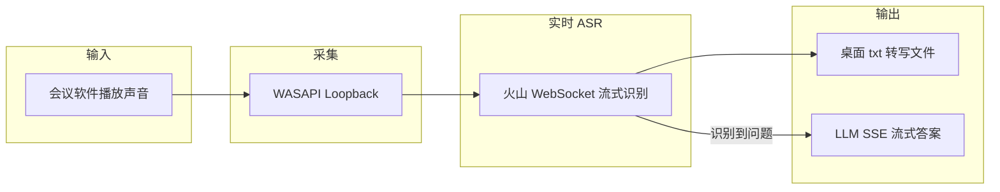
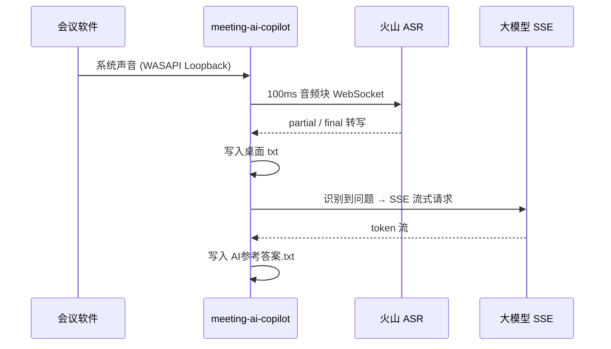

# meeting-ai-copilot

> **会议实时 ASR + LLM 流式答案助手** — 监听 Windows 系统声音，云端实时转写会议语音，识别到问题后流式生成 AI 参考答案。

<p>
  
  
  
  
  
  
</p>

---

## 核心能力

| 模块 | 说明 |
| --- | --- |
| **实时 ASR** | 火山引擎大模型流式语音识别（WebSocket 双向流），100ms 音频块低延迟上送，partial + final 分句输出 |
| **LLM 流式答案** | 识别到面试/问答类语句后，通过 HTTP SSE 流式调用大模型，逐 token 写入桌面文件 |
| **系统声音采集** | WASAPI Loopback 自动检测当前有声音的输出设备，默认不采集麦克风 |
| **热词优化** | 支持内联热词或火山控制台词表（`boosting_table_id`），提升专业术语识别率 |
| ** resilient 运行** | 断线自动重连、跨天自动切换日期文件、问题去重与冷却防重复调用 |

## 数据流



## 快速开始

```powershell
git clone https://github.com/Hou-mingyuan/meeting-ai-copilot.git
cd meeting-ai-copilot
copy config.example.json config.json
# 编辑 config.json 填入 cloud_asr_api_key 与 ai_api_key
启动云端实时转写和AI答案.bat
```

详细步骤见 [USAGE.md](USAGE.md)。部署运维见 [DEPLOYMENT.md](DEPLOYMENT.md)，安全策略见 [SECURITY.md](SECURITY.md)。

## 配置

复制 `config.example.json` 为 `config.json`，填入密钥：

```json
{
  "cloud_asr_api_key": "your-volcengine-asr-key",
  "ai_api_key": "your-volcengine-coding-plan-key"
}
```

也支持环境变量：`VOLC_ASR_API_KEY`、`VOLCENGINE_CODING_PLAN_API_KEY`。

## 项目结构

```
meeting-ai-copilot/
├── src/
│   ├── cloud_asr_volcengine.py   # 入口：ASR WebSocket + 调度
│   └── cloud_runtime.py          # 音频采集、AI SSE、文件输出
├── config.example.json
├── requirements.txt
├── 启动云端实时转写和AI答案.bat
├── README.md
├── USAGE.md
├── DEPLOYMENT.md
├── SECURITY.md
├── CHANGELOG.md
└── VERSION
```

## 诊断与测试

```powershell
python -m py_compile src\cloud_runtime.py src\cloud_asr_volcengine.py
.venv\Scripts\python.exe src\cloud_asr_volcengine.py --config config.example.json --smoke-test
.venv\Scripts\python.exe src\cloud_asr_volcengine.py --diagnose
.venv\Scripts\python.exe src\cloud_asr_volcengine.py --test-asr-handshake
.venv\Scripts\python.exe src\cloud_asr_volcengine.py --test-ai
```

### Docker Desktop smoke

Docker 容器用于验证依赖安装、配置加载、ASR 请求构造和问题识别逻辑；Windows 系统声音采集仍需在宿主机运行。

```powershell
docker compose up --build --abort-on-container-exit --exit-code-from meeting-ai-copilot
```

## 演示指南

面向作品集评审与首次体验。**本项目不提供内置演示账号**，采用 BYOK（Bring Your Own Key）模式：自备火山引擎 ASR Key 与 Coding Plan AI Key 后，按下列顺序完成配置、验收与核心流程演示。

### 演示账号说明

| 项目 | 说明 |
| --- | --- |
| 内置演示账号 | **无** — 不向仓库写入任何共享 Key |
| 体验方式 | 复制 `config.example.json` → 填入自有密钥，或设置环境变量 |
| 无 Key 时可验收 | `--smoke-test` + Docker smoke 可验证依赖与逻辑，**不能**替代真实会议转写 |

### BYOK 配置

1. 复制 `config.example.json` 为 `config.json`
2. 填入火山引擎凭证（Bring Your Own Key）：

| 字段 | 环境变量（可选） | 说明 |
| --- | --- | --- |
| `cloud_asr_api_key` | `VOLC_ASR_API_KEY` | 实时语音识别 API Key |
| `ai_api_key` | `VOLCENGINE_CODING_PLAN_API_KEY` | LLM 参考答案 API Key |
| `cloud_asr_boosting_table_id` | — | 可选，控制台热词表 ID |

> 切勿将含真实 Key 的 `config.json` 提交到 Git。详见 [SECURITY.md](SECURITY.md)。

### smoke-test 与 diagnose

**无密钥验收**（CI / 首次克隆后）：

```powershell
.venv\Scripts\python.exe src\cloud_asr_volcengine.py --config config.example.json --smoke-test
```

预期输出包含三行 `SMOKE OK:` 并以 exit code 0 退出：

```text
SMOKE OK: config loaded
SMOKE OK: ASR start request built
SMOKE OK: AI question heuristic passed
```

**填入 BYOK 后**（Windows 宿主机，正式开会前）：

```powershell
.venv\Scripts\python.exe src\cloud_asr_volcengine.py --config config.json --diagnose
.venv\Scripts\python.exe src\cloud_asr_volcengine.py --test-asr-handshake
.venv\Scripts\python.exe src\cloud_asr_volcengine.py --test-ai
```

| 命令 | 用途 | 通过标准 |
| --- | --- | --- |
| `--smoke-test` | 配置加载、ASR 请求构造、问题识别逻辑 | 三行 `SMOKE OK:`，exit 0 |
| `--diagnose` | 环境、依赖包、音频 loopback 设备、Key 是否已配置 | `api_key: 已配置`，依赖包均为 `OK` |
| `--test-asr-handshake` | ASR WebSocket 握手 | 无报错退出 |
| `--test-ai` | LLM SSE 通道 | 流式返回 token |

### Docker smoke

在无 Windows 音频环境或 CI 中，用容器验证依赖安装、配置加载与问题识别逻辑：

```powershell
docker compose up --build --abort-on-container-exit --exit-code-from meeting-ai-copilot
```

预期容器日志同样输出三行 `SMOKE OK:` 并以 code 0 退出。

> 容器不采集系统声音；完整演示仍需在 Windows 宿主机运行 `启动云端实时转写和AI答案.bat`。

### 核心流程：会议 → 转写 → AI

1. **启动**：运行 `启动云端实时转写和AI答案.bat`（自动创建 `.venv` 并安装依赖）
2. **会议**：打开腾讯会议等，确保声音从扬声器/耳机播放（默认不采集麦克风）
3. **转写**：WASAPI Loopback 采集 → 火山 WebSocket 流式 ASR → 写入桌面 `实时监听\YYYY-MM-DD_实时监听.txt`
4. **AI 答案**：识别到面试/问答语句后，SSE 流式调用大模型 → 写入 `YYYY-MM-DD_AI参考答案.txt`



更多细节见 [USAGE.md](USAGE.md)。

## 版本

当前版本：**1.0.0**（见 [VERSION](VERSION) 与 [CHANGELOG.md](CHANGELOG.md)）

## 许可证

[MIT License](LICENSE)
