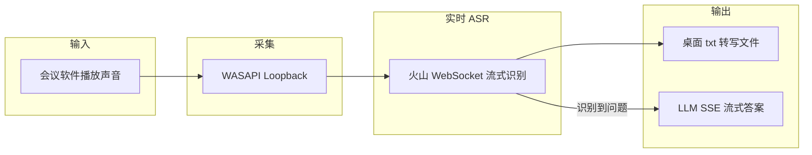

# meeting-ai-copilot

> **会议实时 ASR + LLM 流式答案助手** — 监听 Windows 系统声音，云端实时转写会议语音，识别到问题后流式生成 AI 参考答案。

<p>
  
  
  
  
  
</p>

---

## 核心能力

| 模块 | 说明 |
| --- | --- |
| **实时 ASR** | 火山引擎大模型流式语音识别（WebSocket 双向流），100ms 音频块低延迟上送，partial + final 分句输出 |
| **LLM 流式答案** | 识别到面试/问答类语句后，通过 HTTP SSE 流式调用大模型，逐 token 写入桌面文件 |
| **系统声音采集** | WASAPI Loopback 自动检测当前有声音的输出设备，默认不采集麦克风 |
| **热词优化** | 支持内联热词或火山控制台词表（`boosting_table_id`），提升专业术语识别率 |
| ** resilient 运行** | 断线自动重连、跨天自动切换日期文件、问题去重与冷却防重复调用 |

## 数据流



## 快速开始

```powershell
git clone https://github.com/Hou-mingyuan/meeting-ai-copilot.git
cd meeting-ai-copilot
copy config.example.json config.json
# 编辑 config.json 填入 cloud_asr_api_key 与 ai_api_key
启动云端实时转写和AI答案.bat
```

详细步骤见 [USAGE.md](USAGE.md)。

## 配置

复制 `config.example.json` 为 `config.json`，填入密钥：

```json
{
  "cloud_asr_api_key": "your-volcengine-asr-key",
  "ai_api_key": "your-volcengine-coding-plan-key"
}
```

也支持环境变量：`VOLC_ASR_API_KEY`、`VOLCENGINE_CODING_PLAN_API_KEY`。

## 项目结构

```
meeting-ai-copilot/
├── src/
│   ├── cloud_asr_volcengine.py   # 入口：ASR WebSocket + 调度
│   └── cloud_runtime.py          # 音频采集、AI SSE、文件输出
├── config.example.json
├── requirements.txt
├── 启动云端实时转写和AI答案.bat
├── README.md
├── USAGE.md
├── CHANGELOG.md
└── VERSION
```

## 诊断与测试

```powershell
python -m py_compile src\cloud_runtime.py src\cloud_asr_volcengine.py
.venv\Scripts\python.exe src\cloud_asr_volcengine.py --config config.example.json --smoke-test
.venv\Scripts\python.exe src\cloud_asr_volcengine.py --diagnose
.venv\Scripts\python.exe src\cloud_asr_volcengine.py --test-asr-handshake
.venv\Scripts\python.exe src\cloud_asr_volcengine.py --test-ai
```

### Docker Desktop smoke

Docker 容器用于验证依赖安装、配置加载、ASR 请求构造和问题识别逻辑；Windows 系统声音采集仍需在宿主机运行。

```powershell
docker compose up --build --abort-on-container-exit --exit-code-from meeting-ai-copilot
```

## 版本

当前版本：**1.0.0**（见 [VERSION](VERSION) 与 [CHANGELOG.md](CHANGELOG.md)）

## 许可证

[MIT License](LICENSE)
