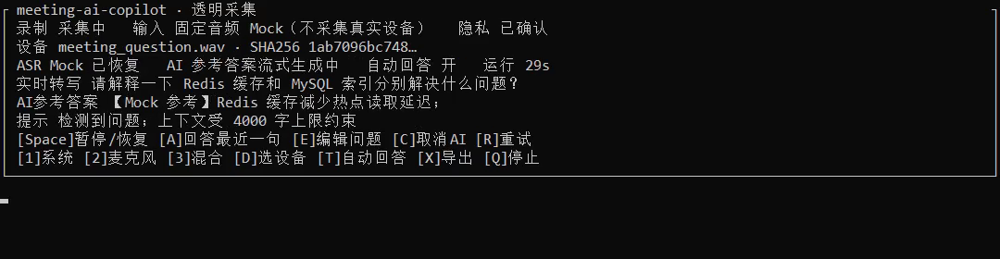
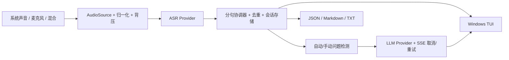

# meeting-ai-copilot

Windows 会议实时转写与 AI 参考答案工具。用户明确确认后，可采集系统声音、麦克风或混合输入，通过火山引擎流式 ASR 显示分句转写，并对自动检测或手动编辑的问题生成流式 AI 参考答案。

> 当前版本：`1.1.0-rc.1`。真实 ASR/AI 采用 BYOK；仓库不包含密钥。Mock 模式显著标记为固定音频和本地替身，不代表真实模型效果。



[60 秒固定音频 Mock 演示录屏](docs/media/mock-demo-60s.mp4)

## 先体验：零密钥一键闭环

Windows 双击：

```text
一键Mock演示.bat
```

或运行：

```powershell
python src\cloud_asr_volcengine.py --mock-demo
```

该流程读取仓库固定 WAV `tests/fixtures/meeting_question.wav`，依次验证：

```text
固定音频 -> Mock ASR partial/final -> 一次断线恢复 -> 问题检测
         -> Mock AI 取消与重试 -> JSON 会话 -> Markdown/TXT 导出
```

通过时输出 `MOCK ACCEPTANCE PASSED`。固定数据的 SHA-256 与期望 final 文本记录在同目录 JSON；重复运行可比较，不需要会议正在播放，也不调用外部服务。

## 真实会议

1. 复制 `config.example.json` 为 `config.json`。
2. 优先设置环境变量 `VOLC_ASR_API_KEY`、`VOLCENGINE_CODING_PLAN_API_KEY`，也可只在本机 `config.json` 填入。
3. 双击 `启动云端实时转写和AI答案.bat`，选择“开始真实会议采集”。
4. 程序先显示采集范围、ASR/AI 数据去向和本地目录；只有输入 `Y` 才打开音频设备。

启动菜单支持：Mock 演示、真实会议、设备诊断、设备列表。没有 Python 时可使用构建出的 Windows 便携包。

## 输入与交互

| 能力 | 行为 |
| --- | --- |
| 系统声音 | WASAPI loopback，支持稳定设备 ID 与名称选择 |
| 麦克风 | 独立采集，单声道 16 kHz 归一化 |
| 混合 | 系统声音与麦克风分别采集后混合，任一路短暂失效时继续处理可用输入 |
| 热切换 | TUI 按 `1`/`2`/`3` 切换输入模式，按 `D` 输入稳定设备 ID/名称；设备消失时自动重开 |
| 背压 | 有界缓冲区满时丢弃最旧块，优先保持实时性并记录计数 |
| 暂停/恢复 | `Space`；暂停时不向 ASR 发送新音频，恢复后清理陈旧缓冲 |
| 手动问题 | `A` 回答最近一句；`E` 编辑后提交 |
| AI 控制 | `C` 取消、`R` 重试、`T` 开关自动回答 |
| 保存/导出 | `X` 导出；停止时自动保存 JSON 并导出 Markdown/TXT |
| 停止 | `Q` 或 `Ctrl+C`；等待音频、AI、TUI 线程关闭 |

TUI 在 40、60、100、140 列宽下有固定 10 行布局测试，实时转写与 AI 参考答案分行显示；长设备名和中文长文本会截断，不产生横向溢出。

## 可靠性边界

- ASR 处理 partial/final、乱序 partial、重复 final、心跳、连接超时、指数退避和最多 6 次连续重连。
- 鉴权失败不重试；429 与暂时性网络/5xx 错误按上限重试。
- 未确认音频保留在有界重放缓冲；重连后重放。已确认 final 在断线前立即落盘，不因重连删除。
- AI SSE 必须收到完成事件；提前断线按上限重试，并去除已输出前缀，避免重复答案。
- AI 有总超时、流空闲超时、最大答案字符数和取消令牌；答案始终标记为“AI 参考答案（非会议原话）”。
- 每次运行创建独立 `session_id`，上下文最多 4000 字，不跨会话复用。

## 本地数据

默认目录：`桌面\实时监听\`。

| 文件 | 说明 |
| --- | --- |
| `session-<id>.json` | 结构化会话、来源、时间戳、问题、答案状态、隐私确认与状态事件 |
| `session-<id>.md/.txt` | 人工可读导出，AI 与会议原话分区 |
| `YYYY-MM-DD_实时监听.txt` | 兼容版 final 转写 |
| `YYYY-MM-DD_临时识别.txt` | 当前 partial，覆盖写 |
| `YYYY-MM-DD_AI参考答案.txt` | 兼容版流式 AI 输出 |
| `YYYY-MM-DD_运行日志.txt` | 运行状态；不记录 API Key，不写完整转写正文 |

默认保留 30 天，只清理应用拥有的 `session-*` 文件。可用 `output_directory` 和 `session_retention_days` 修改。

## 架构



稳定契约位于 `src/app_contracts.py`；音频、ASR 恢复、问题检测、LLM、会话存储分别位于独立模块。详见 [架构文档](docs/ARCHITECTURE.md)。

## 验收

完整 Windows 本地验收：

```powershell
.\一键验收.bat --no-pause
```

或按范围运行：

```powershell
python -m ruff check src tests scripts loadtest
python -m pytest tests -q
python scripts\repo_checks.py
python src\cloud_asr_volcengine.py --windows-audio-acceptance
docker compose up --build --abort-on-container-exit --exit-code-from meeting-ai-copilot
powershell -File scripts\build-portable.ps1
```

Mock HTTP 服务只允许绑定本机 `19060-19069`；默认端口 `19060`。端口范围外会直接退出非零。

本机 Windows 实采已用同一固定 WAV 验证 Realtek loopback 主频、麦克风打开、混合输入、暂停/恢复、Realtek 与 ToDesk 热切换、停止和零残留音频线程。真实指标、命令和边界见 [验收记录](docs/ACCEPTANCE.md) 与 [性能报告](PERFORMANCE_REPORT.md)。

## Docker 边界

Docker 只验证 Linux 镜像依赖、配置、ASR 请求构造和问题检测：

```powershell
docker compose up --build --abort-on-container-exit --exit-code-from meeting-ai-copilot
```

容器不能证明 Windows WASAPI 采音。Windows 真实设备验收必须运行 `--windows-audio-acceptance`，两类证据在文档中分开记录。

## 便携包

```powershell
powershell -File scripts\build-portable.ps1
powershell -File scripts\test-portable.ps1 -ZipPath dist\meeting-ai-copilot-1.1.0-rc.1-win-x64.zip
```

便携 ZIP 包含运行时，不依赖系统 Python。clean-profile smoke 会在带空格的临时路径、独立 `USERPROFILE` 下运行 EXE 版本、smoke、Mock 会话和一键启动脚本。当前 EXE 未签名，也未发布。详见 [便携版说明](便携版说明.md)。

## 文档

- [使用指南](USAGE.md)
- [部署与故障排查](DEPLOYMENT.md)
- [安全与隐私](SECURITY.md)
- [架构](docs/ARCHITECTURE.md)
- [验收证据与已知限制](docs/ACCEPTANCE.md)
- [性能报告](PERFORMANCE_REPORT.md)
- [变更记录](CHANGELOG.md)

许可证：[MIT](LICENSE)。
