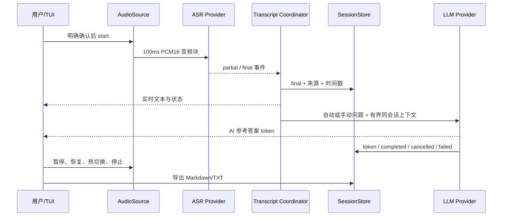

# 架构与运行状态

## 模块边界

| 模块 | 职责 |
| --- | --- |
| `app_contracts.py` | AudioSource、AsrProvider、LlmProvider、QuestionDetector、SessionStore 公共数据与协议 |
| `audio_pipeline.py` | 设备枚举、系统/麦克风/混合采集、采样率/声道转换、静音、背压、热切换、fixture 源 |
| `cloud_asr_volcengine.py` | 火山请求构造、WebSocket provider、协调器、TUI 命令与 CLI |
| `asr_resilience.py` | 重连预算、错误分类、未确认音频重放、partial/final 调和 |
| `question_detection.py` | 自动评分、阈值、冷却、去重、手动强制触发 |
| `llm_providers.py` | 确定性 Mock、OpenAI-compatible/Responses SSE、完成事件、取消和重试 |
| `session_store.py` | 原子 JSON、状态事件、保留策略、Markdown/TXT 导出 |
| `status_tui.py` | 固定 10 行 Windows TUI、转写/答案分区、宽字符布局和快捷键邮箱 |
| `offline_demo.py` | 固定 fixture 的零密钥确定性验收 |

## 实时链路

## 状态

采集状态：`waiting -> recording <-> paused -> stopped`；设备异常时进入 `device_recovering`，重新枚举成功后回到 `recording`。

ASR 状态：`connecting -> connected -> reconnecting(n/max) -> connected`。鉴权失败直接终止；连续可重试失败超过配置上限后终止。已确认 final 已落盘，不回滚。

AI 状态：`idle -> queued -> streaming -> completed/cancelled/failed`。取消 AI 不停止 ASR。重试创建新的 `request_id`，仍属于同一会话。

## 音频语义

- 目标格式为 16kHz、单声道、PCM16 little-endian。
- 多声道先求平均；不同采样率使用线性插值。采集库通常由 WASAPI 完成设备侧转换，纯函数仍有自动化回归。
- 混合输入各自由工作线程读取，协调器取同一读取窗口内的块并求平均。
- 各源缓冲和 ASR 队列有界。满时丢弃最旧数据以限制延迟，计数可诊断。
- 暂停期间底层设备继续读取但立即丢弃数据，同时清空尚未发送队列和重放窗口；恢复后只发送当前声音。

## ASR 重连语义

发送成功但尚未由 final 确认的音频进入有界重放缓冲。连接断开后新连接先重放，再发送实时队列。供应商协议没有逐音频块确认，因此 final 到达时确认当前重放窗口；可能重复识别的 final 由事件 ID/短时文本窗口去重。

该策略保证已确认文本不丢失，并尽量恢复断线窗口；不能承诺在超过重放缓冲或供应商故障时零音频损失。

## 会话与隐私

每次运行生成随机 `session_id`。会话 JSON 使用临时文件、`fsync`、`os.replace` 原子更新。AI 上下文从当前会话 final deque 截取，不读取其它会话文件。

日志与会话分离：日志不保存完整会议正文；会话文件按用户配置保存在本地。Key 只存在于进程配置/请求头，不进入模型、会话或日志。

## 扩展 provider

新增 provider 应实现 `app_contracts.py` 的最小协议，返回统一 `AppError`：

- 鉴权错误：不可重试。
- 限流/网络/暂时性服务错误：明确 `retryable` 与可选 `retry_after`。
- 取消：尽快检查 `CancellationToken`。
- 流式 LLM：必须提供明确完成边界，提前 EOF 不能当成功。

Mock provider 与真实 provider 使用同一事件模型，但 Mock 名称、来源和答案标签必须保留。
